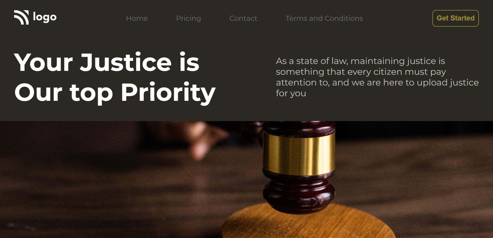

# Restaurant Project

## Description

A Static LAW Home Web page Created using `HTML` and `CSS`.

This project is Hosted on `Netlify`

**Created By :** Yogesh Yadav

## Learing from this Project

- How to use Margin and padding to provide spaces between elements
- Hoe to use images in Web page with the help of `CSS`

__Project Snap Shot__

> Please find the Link of the Project
[__Law_Home_page__](https://merry-arithmetic-63deaa.netlify.app/)

